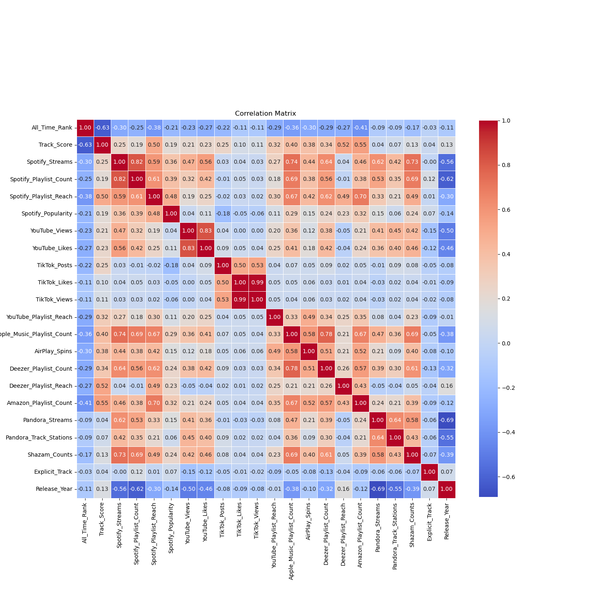

# Ranking Improvement with Spotify Dataset

#### This repo is for exploring, cleaning, and preprocessing Spotify's most streamed song dataset from 2024 to build various machine learning and deep learning models to improve rankings.

This repo compare the performance of different algorithms, including a quantum neural network.


## Requirements

- Python 3.7+
- Libraries listed in 
  - `environment.yml` 
  - `requirements.txt`

## Installation

1. Clone this repository:
   ```
   git clone https://github.com/peeti-sriwongsanguan/ranking-spotify-EDA-PyTorch.git
   ```

2. Create a virtual environment (optional):
   ```
   conda activate spotify-ranking && conda update -y -n base -c conda-forge conda
   ```

3. Install the required libraries: (already in the yml but I ran into packages not found error)
   ```
   pip install -r requirements.txt
   ```
   
## Project Struture
```
ranking_spotify/
│
├── data/
│   └── Most Streamed Spotify Songs 2024.csv.zip
│
├── src/
│   ├── __init__.py
│   ├── data_processing.py
│   └── model.py
│
├── main.py
├── .gitignore
├── requirements.txt
├── enyironment.yml
└── README.md
```

## Usage

1. Ensure your Spotify dataset CSV file is in the same directory as the script and named `spotify_dataset.csv`.

2. Run the main script:
   ```
   python main.py
   ```

3. The script will output:
   - A plot comparing the Mean Squared Error (MSE) and R-squared (R2) scores for all models.
   - Printed results for each model in the console.
   - The best performing model based on MSE.

## Exploratory Data Analysis

The following plot shows the missing value columns


The following plot shows the correlation matrix



### Highly Correlated Features

| Feature 1                     | Feature 2                      | Correlation |
|-------------------------------|--------------------------------|-------------|
| TikTok_Likes                  | TikTok_Views                   | 0.993       |
| YouTube_Views                 | YouTube_Likes                  | 0.834       |
| Spotify_Streams               | Spotify_Playlist_Count         | 0.815       |
| Apple_Music_Playlist_Count    | Deezer_Playlist_Count          | 0.774       |
| Spotify_Streams               | Apple_Music_Playlist_Count     | 0.745       |
| Spotify_Streams               | Shazam_Counts                  | 0.735       |


## Models Implemented

### Machine Learning Models
- Random Forest
- Gradient Boosting
- Support Vector Regression (SVR)
- Elastic Net
- K-Nearest Neighbors (KNN)

### Deep Learning Models
- Simple Neural Network
- Deep Neural Network
- Residual Neural Network
- Long Short-Term Memory (LSTM) Network
- Convolutional Neural Network (CNN)

### Quantum Machine Learning
- Hybrid Quantum-Classical Neural Network

