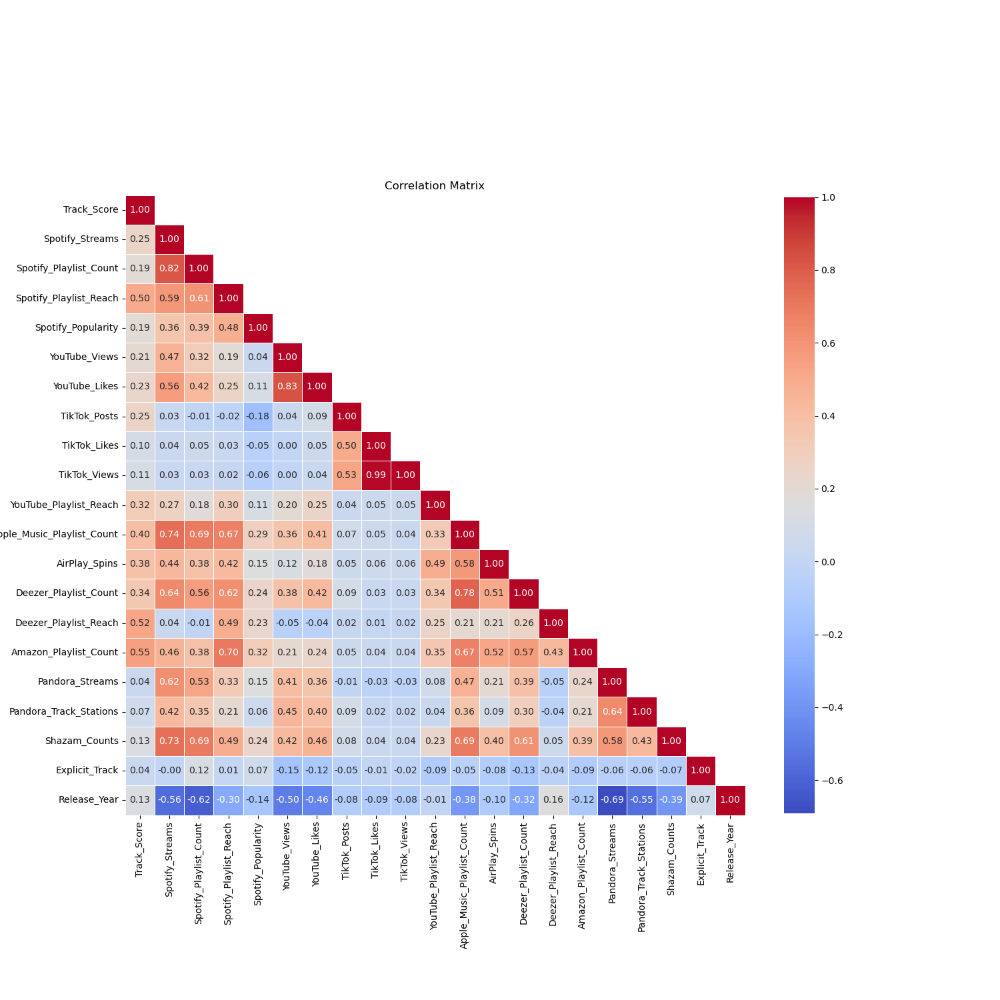

# Ranking Improvement with Spotify Dataset

#### This repo is for exploring, cleaning, and preprocessing Spotify's most streamed song dataset from 2024 to build various machine learning and deep learning models to improve rankings.

This repo compare the performance of different algorithms, including a quantum neural network.


## Requirements

- Python 3.7+
- Libraries listed in 
  - `environment.yml` 
  - `requirements.txt`

## Installation

1. Clone this repository:
   ```
   git clone https://github.com/peeti-sriwongsanguan/ranking-spotify-EDA-PyTorch.git
   ```

2. Create a virtual environment & Install the required packages:
   ```
   conda env create -f environment.yml && conda activate spotify-ranking && conda update -y -n base -c conda-forge conda
   ```
   
## Project Struture
```
ranking_spotify/
│
├── data/
│   └── Most Streamed Spotify Songs 2024.csv.zip
│
├── src/
│   ├── __init__.py
│   ├── data_processing.py
│   └── model.py
│
├── main.py
├── .gitignore
├── requirements.txt
├── enyironment.yml
└── README.md
```

## Usage

1. Ensure your Spotify dataset CSV file is in the same directory as the script and named `spotify_dataset.csv`.

2. Run the main script:
   ```
   python main.py
   ```

3. The script will output:
   - A plot comparing the Mean Squared Error (MSE) and R-squared (R2) scores for all models.
   - Printed results for each model in the console.
   - The best performing model based on MSE.

## Exploratory Data Analysis

The following plot shows the missing value columns


The following plot shows the correlation matrix


### Highly Correlated Features

| Feature 1                     | Feature 2                      | Correlation |
|-------------------------------|--------------------------------|-------------|
| TikTok_Likes                  | TikTok_Views                   | 0.993       |
| YouTube_Views                 | YouTube_Likes                  | 0.834       |
| Spotify_Streams               | Spotify_Playlist_Count         | 0.815       |
| Apple_Music_Playlist_Count    | Deezer_Playlist_Count          | 0.774       |
| Spotify_Streams               | Apple_Music_Playlist_Count     | 0.745       |
| Spotify_Streams               | Shazam_Counts                  | 0.735       |


## Models Implemented

### Machine Learning Models
- Random Forest
- Gradient Boosting
- Support Vector Regression (SVR)
- Elastic Net
- K-Nearest Neighbors (KNN)

### Deep Learning Models
- Simple Neural Network
- Deep Neural Network
- Residual Neural Network
- Long Short-Term Memory (LSTM) Network
- Convolutional Neural Network (CNN)

### Quantum Machine Learning
- Hybrid Quantum-Classical Neural Network

## Results

The following plot shows the model results.


I implemented hyperparameter tuning for all models using techniques such as RandomizedSearchCV for traditional ML models and custom tuning for neural networks.

## Model Performance (R² Scores)

| Model             | Non-tuned R² Score | Tuned R² Score |
|-------------------|--------------------|----------------|
| Random Forest     | 0.3229             | 0.3249         |
| XGBoost           | -                  | 0.3278         |
| Gradient Boosting | 0.3204             | 0.3244         |
| SVR               | 0.3091             | 0.3091         |
| Elastic Net       | -0.0068            | 0.2604         |
| KNN               | 0.2247             | 0.2463         |
| LightGBM          | -                  | 0.3454         |
| Simple NN         | 0.2002             | 0.2574         |
| Deep NN           | 0.1932             | 0.2221         |
| Residual NN       | 0.1804             | 0.2732         |
| LSTM              | 0.1905             | 0.2424         |
| Quantum NN        | -                  | -              |


## Key Findings

1. The best-performing model was the tuned LightGBM with an R² score of 0.3454.
2. Hyperparameter tuning improved the performance of most models, with significant improvements seen in Elastic Net and neural network models.
3. Traditional machine learning models (Random Forest, XGBoost, Gradient Boosting) performed better than neural network models for this dataset.
4. The Elastic Net model showed the most dramatic improvement from tuning, going from a negative R² score to a positive one.

## What Worked Well

- Feature engineering and polynomial features creation improved model performance.
- Hyperparameter tuning significantly enhanced the performance of most models.
- LightGBM proved to be the most effective algorithm for this particular dataset.

## Challenges and Limitations

- The overall R² scores are relatively low, indicating that predicting song rankings is a challenging task with the given features.
- Neural network models, despite tuning, did not outperform traditional machine learning models.
- **The Quantum NN** model encountered issues and couldn't be successfully implemented or evaluated.

## Future Work

- Explore more advanced feature engineering techniques.
- Investigate why neural networks underperformed and experiment with different architectures.
- Collect more data or incorporate additional relevant features to improve prediction accuracy.
- Experiment with ensemble methods combining the best-performing models.
- Revisit the Quantum NN implementation to resolve issues and evaluate its performance.

## Conclusion
While I was able to improve model performance through tuning, the task of predicting Spotify song rankings remains challenging. The best model (tuned LightGBM) explains about 34.54% of the variance in the target variable, suggesting that there might be other factors influencing song rankings that are not captured in the current dataset or that the relationship between the features and the target is highly complex and non-linear.